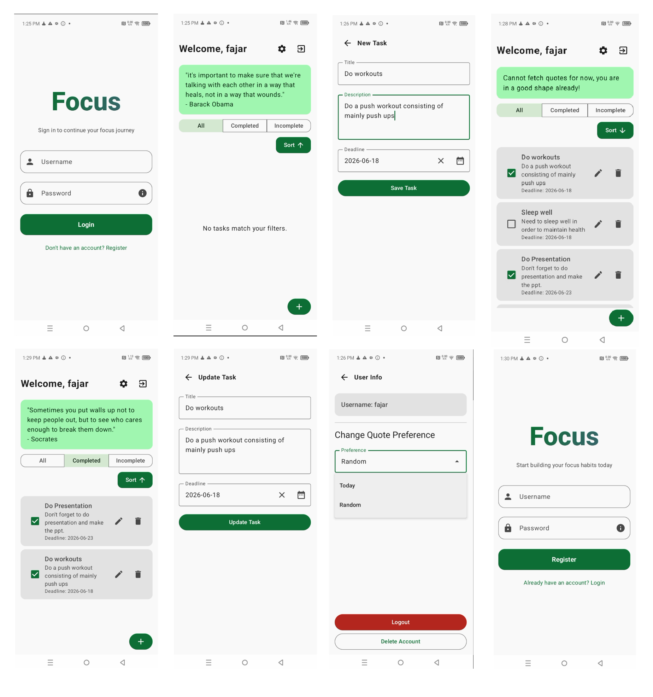

# Product Requirements Document (PRD) — Focus App

## Anggota
<div align="center">

| Nama Anggota | NRP |
|:---:|:---:|
| Kadek Fajar Pramartha Yasodana | 5025231185 |

</div>

## Screenshots
<div align="center">
  
</div>

## File Presentasi
https://docs.google.com/presentation/d/1nsJaWs2hh-HBGRIqEU9ugC9BHpq4ll_b/edit?usp=sharing&ouid=118235778697763966764&rtpof=true&sd=true

## APK File
https://github.com/FajarY/Focus/releases/download/Release/Focus.apk

## 1. Informasi Produk

**Nama Produk:** Focus

**Versi:** 1.0

**Platform:** Android

**Teknologi:**
- Kotlin
- Jetpack Compose (UI)
- Room Database (Local Storage untuk User & To-Do Items)
- MVVM Architecture
- StateFlow (Reactive State Management)
- Retrofit + Gson Converter (Integrasi ZenQuotes API)
- OkHttp dengan Logging Interceptor
- Material Design 3

**Target Pengguna:**
- Pelajar dan profesional yang membutuhkan pengelolaan tugas harian
- Pengguna yang ingin meningkatkan produktivitas dengan dorongan motivasi (quotes)
- Individu yang mencari aplikasi to-do list sederhana dengan akun personal

## 2. Latar Belakang

Banyak aplikasi to-do list yang tersedia di pasaran cenderung kompleks atau tidak memberikan elemen motivasi kepada penggunanya. Pengguna sering kehilangan semangat dalam menyelesaikan tugas harian karena tidak ada pengingat atau dorongan psikologis. Focus dirancang sebagai aplikasi pengelolaan tugas yang dipadukan dengan kutipan motivasi (zen quotes) harian, sehingga pengguna tidak hanya mencatat tugas, tetapi juga mendapatkan suntikan semangat setiap kali membuka aplikasi.

## 3. Tujuan Produk

Membangun aplikasi Android yang memungkinkan pengguna untuk:

- Membuat akun pribadi dan masuk secara aman (autentikasi lokal).
- Mengelola daftar tugas (to-do list) secara penuh: tambah, lihat, ubah, selesaikan, dan hapus.
- Memfilter dan mengurutkan tugas berdasarkan status penyelesaian dan tenggat waktu (deadline).
- Mendapatkan kutipan motivasi harian atau acak sesuai preferensi pengguna.
- Mengatur preferensi akun, termasuk jenis kutipan yang ditampilkan dan penghapusan akun.

## 4. Problem Statement

- Pengguna kesulitan melacak tugas yang sudah selesai dan yang belum, terutama ketika daftar tugas semakin panjang.
- Tidak ada elemen motivasi pada aplikasi to-do list konvensional yang dapat mendorong pengguna untuk tetap produktif.
- Pengurutan tugas berdasarkan tenggat waktu sering tidak tersedia secara fleksibel (ascending/descending).
- Data tugas pengguna perlu terikat secara personal (per akun), bukan tersimpan secara global tanpa pemilik.

## 5. Success Metrics

**Functional Metrics:**
- Pengguna berhasil registrasi dan login menggunakan kombinasi username & password yang tersimpan di Room Database.
- Tugas (To-Do Item) berhasil dibuat, diperbarui, ditandai selesai, dan dihapus sesuai aksi pengguna.
- Kutipan (quote) berhasil ditarik dari ZenQuotes API sesuai preferensi pengguna (today/random).
- Filter dan sorting pada daftar tugas berjalan sesuai pilihan pengguna.

**Technical Metrics:**
- Relasi data antara `User` dan `ToDoItem` konsisten melalui foreign key dengan cascade delete.
- Aplikasi tetap menampilkan fallback message ketika API kutipan gagal diakses (tanpa membuat aplikasi crash).
- State UI (loading, error) terkelola dengan baik melalui StateFlow tanpa menyebabkan tampilan macet.

## 6. User Persona

**Nama:** Fajar

**Umur:** 22 Tahun

**Pekerjaan:** Mahasiswa Tingkat Akhir

**Kebutuhan:**
- Mencatat tugas kuliah dan deadline pengumpulan tanpa perlu aplikasi yang rumit.
- Mendapatkan dorongan motivasi singkat setiap kali membuka aplikasi agar tetap fokus mengerjakan tugas.
- Memilah tugas yang sudah selesai dan yang masih tertunda dengan cepat.

## 7. Scope Produk

**In Scope:**
- Autentikasi pengguna (Register, Login, Logout, Delete Account) berbasis Room Database lokal.
- Manajemen To-Do List penuh (Create, Read, Update, Delete, Toggle Completed).
- Filter daftar tugas (All / Completed / Incomplete).
- Sorting daftar tugas berdasarkan deadline (Ascending / Descending).
- Integrasi ZenQuotes API untuk kutipan motivasi (mode "today" atau "random").
- Preferensi kutipan yang dapat diubah dan disimpan per pengguna.
- Date picker untuk memilih tenggat waktu tugas.

**Out of Scope:**
- Sinkronisasi data ke server/cloud (saat ini seluruh data tersimpan lokal di perangkat).
- Notifikasi pengingat tugas (reminder/push notification).
- Multi-perangkat (multi-device sync) atau autentikasi berbasis akun cloud (Google/Email OAuth).
- Kategori atau label tugas (tagging) serta sub-tugas (checklist bertingkat).
- Enkripsi password (saat ini password tersimpan dalam bentuk plain text di database lokal).

## 8. User Flow

1. Pengguna membuka aplikasi dan disambut dengan layar Login.
2. Jika belum memiliki akun, pengguna menekan "Register" untuk membuat akun baru (username & password).
3. Setelah berhasil login/registrasi, pengguna diarahkan ke Home Screen yang menampilkan kutipan motivasi dan daftar tugas.
4. Pengguna dapat menambahkan tugas baru melalui tombol "+" yang mengarah ke layar Insert Task.
5. Pengguna dapat memfilter tugas (All/Completed/Incomplete) dan mengurutkan berdasarkan deadline melalui tombol Sort.
6. Pengguna dapat menandai tugas selesai melalui checkbox, mengedit tugas melalui ikon Edit, atau menghapus tugas melalui ikon Delete.
7. Pengguna dapat mengakses halaman User Info untuk mengubah preferensi kutipan, logout, atau menghapus akun.

## 9. Functional Requirements

**FR-01: User Authentication**
Pengguna dapat melakukan registrasi dengan username unik dan password, serta login menggunakan kredensial yang sesuai. Sistem menampilkan pesan error jika username sudah terdaftar atau kredensial tidak valid.

**FR-02: Daily/Random Motivational Quote**
Sistem menampilkan satu kutipan motivasi dari ZenQuotes API setiap kali Home Screen dimuat, sesuai preferensi pengguna ("today" untuk kutipan harian, "random" untuk kutipan acak). Jika API gagal diakses, sistem menampilkan pesan fallback tanpa menghentikan aplikasi.

**FR-03: To-Do Item Management**
Pengguna dapat membuat tugas baru dengan judul, deskripsi, dan tenggat waktu opsional. Tugas yang sudah ada dapat diperbarui (judul, deskripsi, deadline), ditandai selesai/belum selesai, atau dihapus secara permanen.

**FR-04: Filter & Sort To-Do List**
Pengguna dapat memfilter daftar tugas berdasarkan status (All, Completed, Incomplete) dan mengurutkan daftar berdasarkan tenggat waktu secara ascending atau descending.

**FR-05: Quote Preference Management**
Pengguna dapat mengganti preferensi jenis kutipan (today/random) melalui dropdown menu di halaman User Info, yang akan langsung tersimpan ke database dan diterapkan pada pengambilan kutipan berikutnya.

**FR-06: Account Management**
Pengguna dapat logout dari sesi aktif atau menghapus akun secara permanen, yang akan menghapus seluruh data tugas terkait (cascade delete) dari database.

## 10. Non-Functional Requirements

**Performance:** Pengambilan kutipan dari API dikelola dengan flag `isLoadingQuotes` untuk mencegah pengambilan data ganda (duplicate fetch) saat navigasi berulang ke Home Screen.

**Usability:** Antarmuka menggunakan Jetpack Compose dengan Material Design 3, termasuk feedback visual berupa overlay loading (`CircularProgressIndicator`) saat operasi database/jaringan berlangsung.

**Reliability:** Operasi database dibungkus dalam blok try-catch untuk menangani exception (termasuk constraint violation saat username duplikat) tanpa menyebabkan aplikasi crash.

**Data Integrity:** Relasi antar tabel menggunakan foreign key dengan `onDelete = CASCADE`, memastikan seluruh tugas milik pengguna otomatis terhapus saat akun dihapus.

## 11. Database Design (Room)

**Table: users**

| Field | Type | Keterangan |
|---|---|---|
| id | Long (PK, Auto Generate) | Identitas unik pengguna |
| username | String (Unique Index) | Nama pengguna, tidak boleh duplikat |
| password | String | Kata sandi pengguna |
| quotePreference | String | Preferensi kutipan ("today" / "random") |

**Table: todo_items**

| Field | Type | Keterangan |
|---|---|---|
| id | Long (PK, Auto Generate) | Identitas unik tugas |
| title | String | Judul tugas |
| description | String | Deskripsi tugas |
| deadline | String? (Nullable) | Tenggat waktu tugas (format yyyy-MM-dd) |
| completed | Boolean | Status penyelesaian tugas |
| userId | Long (FK ke users.id, Index) | Pemilik tugas, cascade delete |

## 12. Screen List

- **Login Screen:** Form masuk dengan input username & password, serta opsi tampil/sembunyikan password.
- **Register Screen:** Form pendaftaran akun baru dengan username & password.
- **Home Screen:** Tampilan utama berisi kutipan motivasi, filter status, sorting deadline, dan daftar tugas.
- **Insert To-Do Item Screen:** Form penambahan tugas baru (judul, deskripsi, deadline via date picker).
- **Update To-Do Item Screen:** Form pengubahan data tugas yang sudah ada.
- **User Information Screen:** Detail akun pengguna, pengaturan preferensi kutipan, logout, dan hapus akun.

## 13. Navigation Structure

```
Login Screen (Default jika belum login)
├── Register Screen (toggle via "Don't have an account? Register")
└── Home Screen (setelah login/register berhasil)
    ├── Insert To-Do Item Screen (via tombol "+")
    ├── Update To-Do Item Screen (via ikon Edit pada item tugas)
    └── User Information Screen (via ikon Settings)
        └── kembali ke Login Screen (via Logout / Delete Account)
```

## 14. Architecture (MVVM)

**View (Jetpack Compose):** Mengamati (observe) UI State dari ViewModel melalui `collectAsState()`, mencakup layar Login, Register, Home, Insert, Update, dan User Information.

**ViewModel (AppViewModel):** Menangani seluruh logika bisnis aplikasi, termasuk autentikasi, manajemen input form, navigasi antar layar, serta koordinasi pemanggilan Repository.

**Repository:**
- `UserRepository` — mengelola operasi data pengguna (create, login, update preferensi, delete) melalui `UserDao`.
- `ToDoItemRepository` — mengelola operasi data tugas (create, read, update, delete, toggle completed) melalui `ToDoItemDao`.
- `ZenQuotesRepository` — mengelola pengambilan kutipan dari API eksternal melalui `ZenQuotesAPIService` (Retrofit).

**Data Layer:** Room Database (`AppDatabase`) sebagai sumber data lokal, diakses secara singleton melalui `AppDatabaseProvider`.

## 15. Future Enhancement (Version 2.0)

- Enkripsi password menggunakan hashing (misalnya BCrypt) untuk meningkatkan keamanan data pengguna.
- Penambahan kategori/label pada tugas untuk pengelompokan yang lebih terstruktur.
- Notifikasi pengingat (reminder) menjelang tenggat waktu tugas.
- Sinkronisasi data ke cloud agar dapat diakses dari berbagai perangkat.
- Statistik produktivitas pengguna (jumlah tugas selesai per minggu/bulan).

## 16. Deliverables

- Source Code Kotlin (Jetpack Compose, Room, Retrofit, MVVM)
- Implementasi Room Database (User & To-Do Item) beserta relasi foreign key
- Integrasi ZenQuotes API menggunakan Retrofit + Gson Converter
- Jetpack Compose UI Layout untuk seluruh layar aplikasi
- User Manual / PRD (Dokumen ini)

## 17. Definition of Done (DoD)

- [✔] Pengguna dapat melakukan registrasi dan login dengan validasi error yang sesuai.
- [✔] Kutipan motivasi tampil otomatis saat Home Screen dimuat, sesuai preferensi pengguna.
- [✔] Fitur tambah, ubah, hapus, dan tandai selesai pada tugas berfungsi dengan baik.
- [✔] Filter (All/Completed/Incomplete) dan sorting (Ascending/Descending) berdasarkan deadline berfungsi sesuai pilihan pengguna.
- [✔] Preferensi kutipan dapat diubah dan tersimpan secara persisten di database.
- [✔] Penghapusan akun menghapus seluruh data tugas terkait secara otomatis (cascade delete).
- [✔] Aplikasi tidak crash saat API kutipan tidak dapat diakses (menampilkan fallback message).